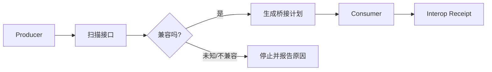

# OPP — Open Reality Protocols

**A protocol and tooling layer for describing, negotiating, connecting, and verifying software capabilities.**  
**用于描述、协商、连接和验证软件能力的协议与工具层。**

OPP 解决一个很具体的问题：两个系统都“会做事”，但接口、字段、权限和证据格式不同，接起来仍然需要大量人工工作。OPP 把这些差异变成可读取、可检查、可转换的结构。

> 当前协议族：`0.1.0-candidate.1`  
> Runtime / Bridge / Semantic Tooling：`0.3.0-candidate.1`  
> 状态：**Candidate**。不是互联网标准，也不是生产安全认证。

## 从这里开始

- 想知道它到底能用在哪：[`docs/USE_CASES.md`](docs/USE_CASES.md)
- 想直接跑起来：看下面的“快速开始”
- 想看当前测试和边界：[`STATUS.md`](STATUS.md)
- 想参与开发：[`CONTRIBUTING.md`](CONTRIBUTING.md)
- 想报告安全问题：[`SECURITY.md`](SECURITY.md)

## 一分钟理解

假设系统 A 输出：

```json
{
  "name": "Alice",
  "phone": "+852..."
}
```

系统 B 需要：

```json
{
  "customer_name": "string",
  "phone": "string"
}
```

OPP 可以做三件事：

1. 扫描双方的输入和输出；
2. 判断它们是精确兼容、结构兼容、有损、不兼容还是未知；
3. 在规则允许时生成一个可审计的转换计划，并实际验证这条连接。

它的目标不是替代现有 API，而是减少“每接一个系统都重新理解、重新写胶水代码”的工作。

## 三个最常见的用途

### 1. 判断两个项目能不能接

```text
Project A
   |
   | output
   v
  OPP
   |
   | compatibility + bridge plan
   v
Project B
```

适合做接口兼容检查、API 迁移、旧系统接新系统、开源项目复用前审计。

### 2. 给 Agent 接工具前先检查契约

先看清楚“这个工具到底会什么、要什么输入、会返回什么”，再决定是否调用，而不是只靠名字猜。

### 3. 自动化执行后留下可验证回执

不仅知道“跑过了”，还保留这次能力协商、转换和执行对应的证据。

更多例子见 [`docs/USE_CASES.md`](docs/USE_CASES.md)。

## 现在能做什么

- 校验 OPP 协议对象和 JSON Schema；
- 描述系统的能力、输入输出、约束和证据；
- 从 Python、JavaScript、TypeScript 和 JSON Schema 提取接口形状；
- 比较两个接口是否兼容；
- 生成受限的声明式字段转换：`identity`、`rename`、`select`、`inject-default`；
- 自动搜索 `producer output -> consumer input` 的连接路径；
- 显式调用受支持的 Python 顶层函数；
- 运行 `Producer -> Bridge -> Consumer`，并生成互操作回执；
- 为桥接、能力协商和执行结果保留可验证证据。

## 工作方式



静态扫描不会执行目标仓库代码。只有显式提供 Invocation Spec，并传入 `--allow-execution` 时才会进入原生调用。

## 适合什么场景

- AI Agent / MCP / A2A 工具接入；
- SaaS 与企业内部系统集成；
- 两个代码仓库之间的接口兼容检查；
- API / Schema 迁移；
- 自动生成集成方案前的静态审计；
- 需要留下执行回执和证据链的自动化流程。

如果两个系统已经有稳定 SDK、字段完全一致，也不需要审计或桥接，直接调用现有 SDK 通常更简单。

## 快速开始

要求：Python 3.10+

```bash
python -m pip install -e .
```

验证示例：

```bash
python -m opp validate examples/capability.json
python -m opp validate examples/artifact.json
```

扫描一个仓库：

```bash
python -m opp semantic verify ./repo --profile auto
```

检查两个仓库能否连接：

```bash
python -m opp semantic connect ./producer-repo ./consumer-repo --out ./connect.json
```

扫描和编译桥接描述：

```bash
opp bridge scan ./repo --profile auto
opp bridge compile ./repo --out ./bridge-output
```

显式允许执行后，运行一个真实互操作链：

```bash
opp interop run examples/interop-run.json examples/interop-input.json \
  --allow-execution \
  --out interop-result.json
```

运行测试：

```bash
python -m unittest discover -s tests -v
```

当前仓库测试状态见 [`STATUS.md`](STATUS.md)。

## OPP 和 TINP 的分工

```text
OPP：这个系统会什么？两个系统能不能接？怎么转换？
TINP：谁能调用？怎么传？失败怎么办？怎么恢复？
```

OPP 可以独立使用；需要身份、权限、路由和恢复时，再进入 TINP 的职责范围。

TINP：<https://github.com/xingxuling/TINP>

## OPP 的 6 个核心协议

| 协议 | 用途 |
|---|---|
| **RXP** — Reality Exchange Protocol | 统一承载状态、意图、能力、约束、证据和动作描述 |
| **RCP** — Reality Capability Protocol | 描述“这个系统会什么、怎么调用、有什么限制” |
| **RAP** — Reality Artifact Protocol | 描述代码、文档、模型、数据库等工件的目标、依赖和验证状态 |
| **REP** — Reality Evidence Protocol | 把主张与来源、方法、置信度和可复现信息绑定 |
| **RSP** — Reality State Protocol | 表达对象、关系、事实、观察、预测和状态根 |
| **CHP** — Civilization Handshake Protocol | 两个陌生系统在交互前先协商版本、能力和约束 |

`Reality` 和 `Civilization` 是 OPP 协议族内部命名，不代表系统自动拥有现实世界权威，也不代表任何外部标准地位。

## 安全边界

当前实现有意保持保守：

- Shell 执行默认禁用；
- 执行必须显式授权；
- 路径必须留在允许目录内；
- 拒绝符号链接逃逸；
- 子进程使用清理后的环境和临时工作目录；
- 有超时和输出大小限制；
- 失败时按失败关闭处理。

当前 **不声称**：

- Linux namespace / seccomp / container / VM 级强沙箱；
- 自动获得新的系统权限；
- 任意第三方项目都能自动兼容；
- 已通过独立第三方互操作认证；
- 已成为任何外部标准。

详细边界见 [`docs/NATIVE_INTEROP.md`](docs/NATIVE_INTEROP.md)、[`SECURITY.md`](SECURITY.md) 和 [`STATUS.md`](STATUS.md)。

## 项目结构

```text
src/opp/
  bridge/       接口扫描、兼容性判断、桥接规划和转换
  runtime/      显式调用与真实互操作运行时
  resources/    协议注册表与 JSON Schema
  capability.py 能力协商
  handshake.py  握手逻辑
  validation.py 协议校验

tests/          单元与互操作测试
examples/       最小示例
docs/           规范、设计和边界说明
```

## 文档

- [`docs/USE_CASES.md`](docs/USE_CASES.md) — 什么时候值得用 OPP
- [`docs/SPECIFICATION.md`](docs/SPECIFICATION.md) — 协议规范
- [`docs/BRIDGE_COMPILER.md`](docs/BRIDGE_COMPILER.md) — Bridge Compiler
- [`docs/SEMANTIC_BRIDGE.md`](docs/SEMANTIC_BRIDGE.md) — 语义桥
- [`docs/AUTO_CONNECT.md`](docs/AUTO_CONNECT.md) — 自动连接
- [`docs/NATIVE_INTEROP.md`](docs/NATIVE_INTEROP.md) — 原生调用与互操作边界
- [`docs/GOVERNANCE.md`](docs/GOVERNANCE.md) — 治理边界
- [`CONTRIBUTING.md`](CONTRIBUTING.md) — 参与开发
- [`SECURITY.md`](SECURITY.md) — 安全问题报告与边界

## 项目状态

OPP 目前是可运行的候选实现，重点在**接口语义、能力协商、受限桥接和可验证执行**。它已经能完成具体夹具上的真实互操作，但仍需要更多第三方项目、更多运行时和独立安全审查来证明通用性。

## License

MIT License。见 [`LICENSE`](LICENSE)。
