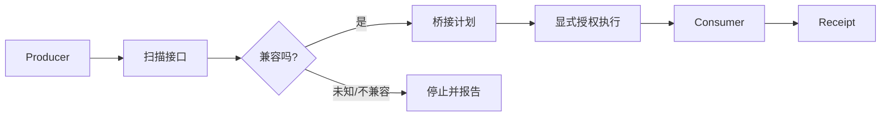

# OPP — Open Reality Protocols

**当你不断把新的 API、Agent、开源项目和内部系统接在一起时，OPP 用来先判断“到底能不能接、差在哪、需要怎么转”，再决定是否执行。**

两个系统都能工作，不代表它们能直接接起来。字段、接口契约、类型和证据格式只要有一项不同，通常就要人工读文档、写 Adapter、反复测试。

OPP 做的事很直接：

> **先把双方看懂 → 判断兼容性 → 生成受限桥接方案 → 明确授权后执行 → 留下回执。**

> 当前状态：Candidate  
> Core Protocols：`0.1.0-candidate.1`  
> Runtime / Bridge / Semantic Tooling：`0.3.0-candidate.1`

## 先看一个业务 Demo

最容易理解 OPP 的方式，不是先读协议，而是看一个很普通的系统对接：

```text
旧预约表单                 新 CRM
name            ->         customer_name
service         ->         service_code
slot            ->         preferred_time
缺少 channel    ->         注入默认来源
多余 debug      ->         不传给 CRM
```

直接运行：

```bash
python -m pip install -e .
python examples/business_demo.py
```

这个 Demo 会真实跑一条本地 `旧预约表单 -> OPP Bridge -> CRM` 链路，并打印原始输入、旧系统输出、转换后的数据、新系统结果和回执根。

它不会访问真实 CRM，也不会假装已经完成生产集成。完整说明见 [`BUSINESS_DEMO.md`](BUSINESS_DEMO.md)。

## 为什么我不直接写一个 Adapter？

如果你只有两个稳定系统，直接写几十行 Adapter 往往更简单，**这时候不一定需要 OPP**。

OPP 开始有价值，是在下面这种情况：

- 接入对象越来越多；
- API / Schema 经常变化；
- Agent 会动态发现新的工具；
- 想在执行前先知道是“精确兼容、可转换、有损、不兼容还是未知”；
- 想把重复发生的接口判断变成可复用流程；
- 执行以后还需要知道这次到底用了什么转换、结果对应哪份回执。

它不是为了把简单集成复杂化，而是为了减少**不断重复理解接口和写胶水代码**的工作。

## 和你已经认识的工具有什么区别？

| 技术/方式 | 主要解决什么 | OPP 补在哪里 |
|---|---|---|
| **直接写 Adapter** | 两个具体系统之间的手工转换 | 接入对象多时，先自动检查差异和可转换性 |
| **SDK / REST / gRPC** | 已知接口怎么调用 | 判断两个端点是否真的兼容 |
| **OpenAPI / JSON Schema** | 描述接口和结构 | 读取结构后做兼容性和桥接判断 |
| **MCP** | Agent 怎么发现和调用工具 | 工具接入前后的能力、输入输出和桥接检查 |
| **A2A** | Agent 与 Agent 怎么协作通信 | 更关注能力契约和数据形状是否能互操作 |
| **TINP** | 身份、权限、路由、恢复、执行证据 | OPP 回答“能不能接”，TINP 处理“谁能调用、失败怎么办” |

完整说明见 [`docs/COMPARISON.md`](docs/COMPARISON.md)。

## 技术最小 Demo（3 分钟）

如果想看更纯粹的接口扫描和互操作夹具：

```bash
python -m pip install -e .
python -m opp semantic verify examples/semantic-fixtures --profile generic
python -m opp interop run examples/interop-run.json examples/interop-input.json \
  --allow-execution \
  --out interop-result.json
```

完整说明见 [`DEMO.md`](DEMO.md)。

一次成功的互操作结果会包含类似下面的结构；实际根值和结果由本次运行决定：

```json
{
  "receipt": {
    "status": "PASS",
    "producerRequestRoot": "...",
    "producerReceiptRoot": "...",
    "bridgePlanRoot": "...",
    "consumerReceiptRoot": "...",
    "finalResultRoot": "...",
    "receiptRoot": "..."
  },
  "producer": {"...": "..."},
  "transformed": {"...": "..."},
  "consumer": {"...": "..."},
  "result": {"...": "..."}
}
```

这个结构来自当前 `Producer -> Bridge -> Consumer` 运行时；它证明的是**这一条具体运行成功**，不是任意第三方项目都能自动兼容。

## 它能做什么

当前工具链可以：

- 从 Python、JavaScript、TypeScript 和 JSON Schema 提取接口形状；
- 判断两个接口是精确兼容、结构兼容、有损、不兼容还是未知；
- 生成受限的声明式转换：`identity`、`rename`、`select`、`inject-default`；
- 自动搜索 `producer output -> consumer input` 的连接路径；
- 显式授权后执行受支持的 Python 顶层函数；
- 运行真实的 `Producer -> Bridge -> Consumer` 链路；
- 为协商、转换和执行留下可验证回执。

## 三个最直接的用途

### 1. 判断两个项目能不能接

```text
Project A -> OPP -> Project B
```

适合接口兼容检查、API 迁移、旧系统接新系统，以及复用开源项目之前的结构审计。

### 2. 给 Agent 接工具前先看清契约

先确认工具需要什么输入、会返回什么、是否存在字段或语义差异，再决定要不要调用。

### 3. 自动化执行后留下一份能复核的记录

不仅知道“跑过了”，还知道当时双方的能力声明、使用了什么转换、调用了什么，以及结果对应哪份 receipt。

更多例子见 [`docs/REAL_WORLD_EXAMPLES.md`](docs/REAL_WORLD_EXAMPLES.md)。

## 工作方式



静态扫描不会执行目标仓库代码。只有显式提供 Invocation Spec，并传入 `--allow-execution` 时才进入原生调用。

## 适合谁 / 不适合谁

### 适合

- 需要持续接入不同 API、Agent 工具和内部系统的平台；
- 需要在执行前自动检查接口兼容性的团队；
- 正在做 API / Schema 迁移或开源项目复用审计；
- 需要受限转换和互操作回执的自动化系统。

### 暂时不适合

- 两个系统已经有稳定官方 SDK，而且结构长期不变；
- 只想找成熟生产级 ESB / iPaaS 产品的客户；
- 需要任意语言、任意运行时都能自动执行的通用平台；
- 需要已经通过独立第三方安全认证的系统。

## OPP 和 TINP 的分工

```text
OPP：这个系统会什么？两个系统能不能接？怎么转换？
TINP：谁能调用？怎么传？失败怎么办？怎么恢复？
```

OPP 可以独立使用。需要身份、权限、路由和恢复时，再进入 TINP 的职责范围。

TINP：<https://github.com/xingxuling/TINP>

## 六个核心协议

| 协议 | 作用 |
|---|---|
| RXP | 统一承载状态、意图、能力、约束、证据和动作描述 |
| RCP | 描述系统会什么、怎么调用、有什么限制 |
| RAP | 描述代码、文档、模型、数据库等工件 |
| REP | 把主张与来源、方法和可复现信息绑定 |
| RSP | 表达对象、关系、事实、观察、预测和状态根 |
| CHP | 两个陌生系统交互前先协商版本、能力和约束 |

`Reality` 和 `Civilization` 是协议族内部命名，不代表系统自动拥有现实世界权威，也不代表外部标准地位。

## 当前边界

OPP 当前**不声称**：

- 任意第三方项目都能自动兼容；
- 已具备 Linux namespace / seccomp / container / VM 级强沙箱；
- 已通过独立第三方互操作认证；
- 已成为互联网或行业标准；
- 一次本机 PASS 等于生产安全。

详细边界见 [`STATUS.md`](STATUS.md)、[`SECURITY.md`](SECURITY.md) 和 [`docs/NATIVE_INTEROP.md`](docs/NATIVE_INTEROP.md)。

## 文档入口

- [`BUSINESS_DEMO.md`](BUSINESS_DEMO.md) — 业务化 Demo：旧预约表单接新 CRM
- [`DEMO.md`](DEMO.md) — 技术最小 Demo
- [`docs/COMPARISON.md`](docs/COMPARISON.md) — 和 Adapter / SDK / MCP / A2A 的关系
- [`docs/USE_CASES.md`](docs/USE_CASES.md) — 什么时候值得用 OPP
- [`docs/REAL_WORLD_EXAMPLES.md`](docs/REAL_WORLD_EXAMPLES.md) — 三个现实业务映射
- [`docs/ARCHITECTURE.md`](docs/ARCHITECTURE.md) — 架构和模块分工
- [`docs/SPECIFICATION.md`](docs/SPECIFICATION.md) — 协议规范
- [`ROADMAP.md`](ROADMAP.md) — 后续路线
- [`SECURITY.md`](SECURITY.md) — 安全边界与报告方式

## 状态与许可

当前仓库测试和候选状态见 [`STATUS.md`](STATUS.md)。

MIT License，见 [`LICENSE`](LICENSE)。
