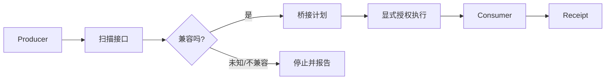

# OPP — Open Reality Protocols

**用于描述、比较、连接和验证软件能力的开放协议与工具层。**

两个系统都能工作，不代表它们能直接接起来。字段、接口契约、权限和证据格式只要有一项不同，通常就要人工读文档、写适配器、反复测试。

OPP 做的事很简单：**先把双方看懂，再判断能不能接；能接时生成受限的桥接方案，明确授权后再执行，并留下回执。**

> 当前状态：Candidate  
> Core Protocols：`0.1.0-candidate.1`  
> Runtime / Bridge / Semantic Tooling：`0.3.0-candidate.1`

## 3 分钟试一下

```bash
python -m pip install -e .
python -m opp semantic verify examples/semantic-fixtures --profile generic
python -m opp interop run examples/interop-run.json examples/interop-input.json \
  --allow-execution \
  --out interop-result.json
```

完整说明见 [`DEMO.md`](DEMO.md)。

## 它能做什么

- 从 Python、JavaScript、TypeScript 和 JSON Schema 提取接口形状；
- 判断两个接口是精确兼容、结构兼容、有损、不兼容还是未知；
- 生成受限的声明式转换：`identity`、`rename`、`select`、`inject-default`；
- 自动搜索 `producer output -> consumer input` 的连接路径；
- 显式授权后执行受支持的 Python 顶层函数；
- 运行真实的 `Producer -> Bridge -> Consumer` 链路；
- 为协商、转换和执行留下可验证回执。

## 三个最直接的用途

### 1. 判断两个项目能不能接

```text
Project A -> OPP -> Project B
```

适合接口兼容检查、API 迁移、旧系统接新系统，以及复用开源项目之前的结构审计。

### 2. 给 Agent 接工具前先看清契约

先确认工具需要什么输入、会返回什么、是否存在字段或语义差异，再决定要不要调用。

### 3. 自动化执行后留下一份能复核的记录

不仅知道“跑过了”，还知道当时双方的能力声明、使用了什么转换、调用了什么，以及结果对应哪份 receipt。

更多例子见 [`docs/REAL_WORLD_EXAMPLES.md`](docs/REAL_WORLD_EXAMPLES.md)。

## 工作方式



静态扫描不会执行目标仓库代码。只有显式提供 Invocation Spec，并传入 `--allow-execution` 时才进入原生调用。

## OPP 和 TINP 的分工

```text
OPP：这个系统会什么？两个系统能不能接？怎么转换？
TINP：谁能调用？怎么传？失败怎么办？怎么恢复？
```

OPP 可以独立使用。需要身份、权限、路由和恢复时，再进入 TINP 的职责范围。

TINP：<https://github.com/xingxuling/TINP>

## 六个核心协议

| 协议 | 作用 |
|---|---|
| RXP | 统一承载状态、意图、能力、约束、证据和动作描述 |
| RCP | 描述系统会什么、怎么调用、有什么限制 |
| RAP | 描述代码、文档、模型、数据库等工件 |
| REP | 把主张与来源、方法和可复现信息绑定 |
| RSP | 表达对象、关系、事实、观察、预测和状态根 |
| CHP | 两个陌生系统交互前先协商版本、能力和约束 |

`Reality` 和 `Civilization` 是协议族内部命名，不代表系统自动拥有现实世界权威，也不代表外部标准地位。

## 当前边界

OPP 当前**不声称**：

- 任意第三方项目都能自动兼容；
- 已具备 Linux namespace / seccomp / container / VM 级强沙箱；
- 已通过独立第三方互操作认证；
- 已成为互联网或行业标准；
- 一次本机 PASS 等于生产安全。

详细边界见 [`STATUS.md`](STATUS.md)、[`SECURITY.md`](SECURITY.md) 和 [`docs/NATIVE_INTEROP.md`](docs/NATIVE_INTEROP.md)。

## 文档入口

- [`DEMO.md`](DEMO.md) — 3 分钟演示
- [`docs/USE_CASES.md`](docs/USE_CASES.md) — 什么时候值得用 OPP
- [`docs/REAL_WORLD_EXAMPLES.md`](docs/REAL_WORLD_EXAMPLES.md) — 三个现实业务映射
- [`docs/ARCHITECTURE.md`](docs/ARCHITECTURE.md) — 架构和模块分工
- [`docs/SPECIFICATION.md`](docs/SPECIFICATION.md) — 协议规范
- [`CONTRIBUTING.md`](CONTRIBUTING.md) — 参与开发
- [`SECURITY.md`](SECURITY.md) — 安全问题报告
- [`ROADMAP.md`](ROADMAP.md) — 后续路线

## 状态与许可

当前仓库测试和候选状态见 [`STATUS.md`](STATUS.md)。

MIT License，见 [`LICENSE`](LICENSE)。
