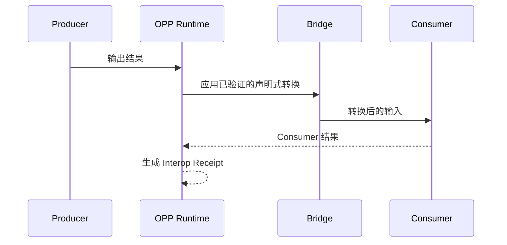

# OPP 架构说明

这份文档只讲模块怎么分工，不展开协议细节。

## OPP 放在什么位置

OPP 不替代 HTTP、REST、MCP、A2A 或数据库协议。

它更像这些接口之上的一层“连接前检查 + 受限转换 + 可验证执行”。

CHA 定位下，本轮新增 `surfaces.py` 与 `session.py`，把下述现有部分组合为动态会话：RCP capability → 显式字段语义/约束协商 → Session Contract → 已有结构 bridge/transform → 调用方 Provider → rooted receipt。它们不替换四个原有部分，也不承担新的网络或授权所有权。详细边界见 [CHA Session](CHA_SESSION.md)。


## 四个主要部分

### 1. Protocol Core

负责协议对象、Schema、能力描述、握手和完整性根。

主要代码：

```text
src/opp/capability.py
src/opp/handshake.py
src/opp/integrity.py
src/opp/registry.py
src/opp/validation.py
src/opp/resources/
```

它回答：

> “双方各自声明了什么？”

### 2. Semantic Bridge

负责从代码和 Schema 中提取接口形状，并判断是否能接。

主要代码：

```text
src/opp/bridge/
```

当前会把关系分成：

```text
exact
structural
lossy
incompatible
unknown
```

它回答：

> “A 的输出能不能成为 B 的输入？”

### 3. Bridge Plan

如果双方结构允许连接，OPP 可以生成受限的声明式转换。

当前允许：

```text
identity
rename
select
inject-default
```

它不会因为“看起来差不多”就随意生成任意 Python 或 Shell 代码。

它回答：

> “如果能接，需要做哪些明确转换？”

### 4. Runtime / Interop

负责在用户明确授权后执行受支持的原生调用，并把 Producer、Bridge、Consumer 串起来。

主要代码：

```text
src/opp/runtime/
```

当前原生调用主要支持 Python 顶层函数。



## 为什么把“扫描”和“执行”分开

这是 OPP 的一个刻意设计。

静态扫描默认不应该等于执行未知代码。只有当用户明确提供 Invocation Spec，并传入 `--allow-execution` 后，运行时才会进入原生调用。

这样可以先做：

```text
理解 -> 判断 -> 计划
```

再决定要不要：

```text
执行
```

## 和 TINP 的边界

OPP 负责：

```text
能力是什么
输入输出是什么
能不能接
怎么转换
这次执行留下什么回执
```

TINP 更关心：

```text
谁能调用
权限什么时候失效
请求走哪条路径
节点挂了怎么办
任务中断后怎么恢复
```

所以 OPP 可以单独使用，也可以作为 TINP 的能力与互操作层。

## 当前成熟度

OPP 已经不是纯规范：当前仓库有可执行 CLI、静态扫描、桥接计划和真实 Producer -> Bridge -> Consumer 夹具。

但它仍然是 Candidate。当前没有证明：

- 任意第三方项目普遍兼容；
- 强 OS 级隔离；
- 独立第三方互操作认证；
- 外部标准地位。

详细状态见 [`../STATUS.md`](../STATUS.md)。
